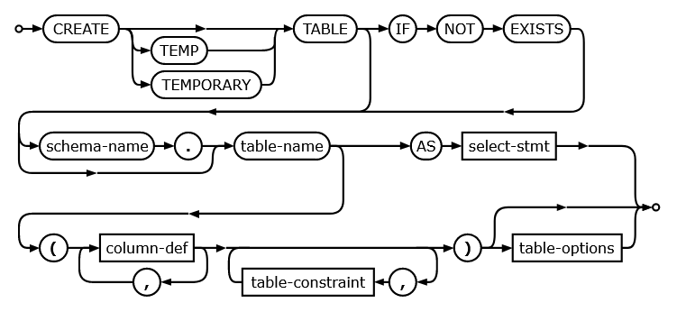
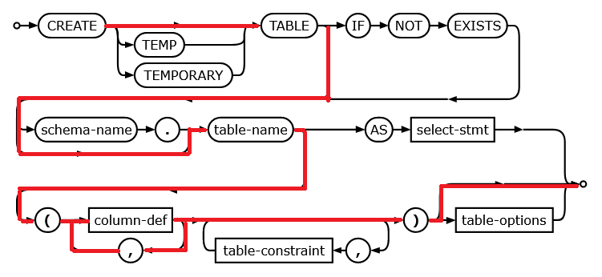
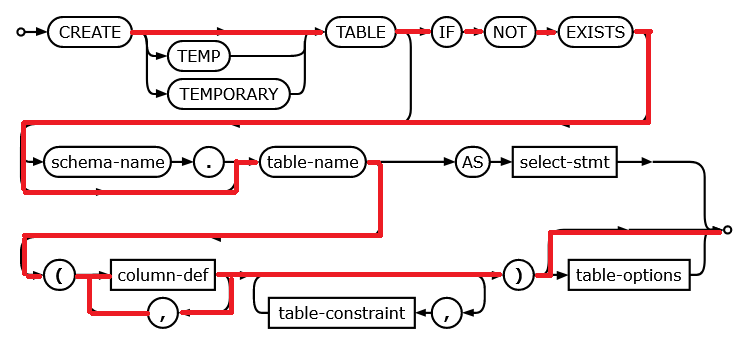
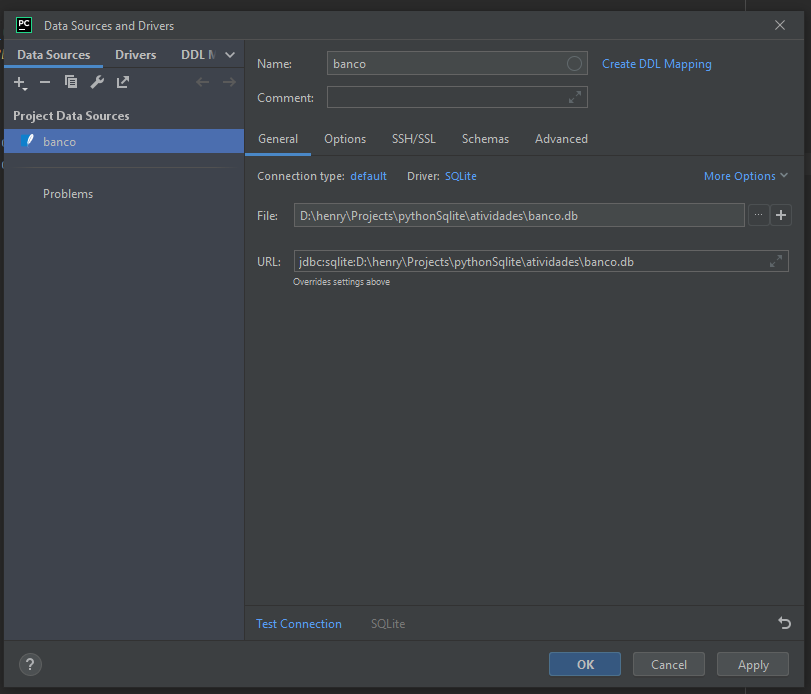
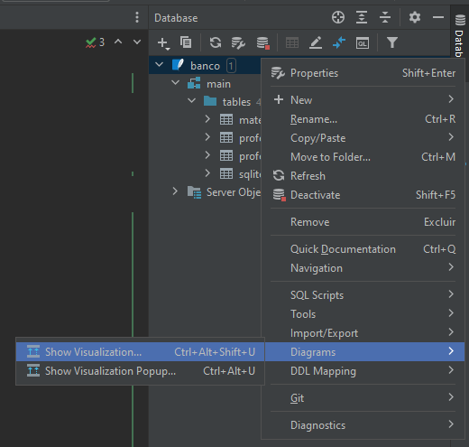
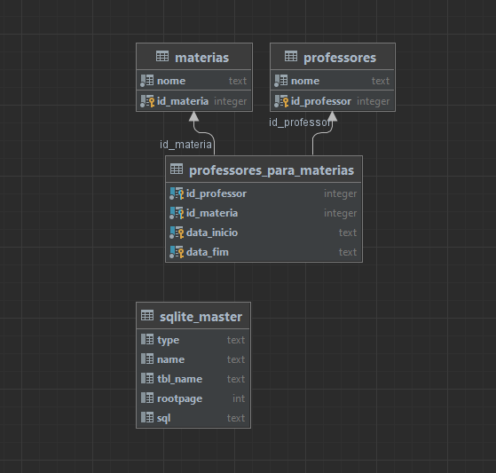
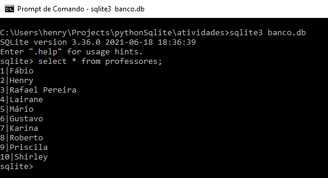

# pythonSqlite

Este repositório organiza o conhecimento necessário para trabalhar com sqlite em Python.

## Sumário

<!-- TOC -->
* [Introdução](#introdução)
* [Sintaxe](#sintaxe)
* [Principais comandos](#principais-comandos)
* [Configurando no Pycharm](#configurando-no-pycharm)
  * [Executando um comando SQL](#executando-um-comando-sql)
  * [Gerando o diagrama do banco de dados](#gerando-o-diagrama-do-banco-de-dados)
* [Configurando pela linha de comando](#configurando-pela-linha-de-comando)
<!-- TOC -->

## Introdução

SQL é como nos referimos genericamente à todas as linguagens de busca, empregadas em bancos de dados relacionais. sqlite
é um **dialeto** SQL (ou seja, uma versão específica), que serve para determinados propósitos. sqlite, por exemplo, 
costuma ser usado em bancos de dados pequenos, como de aplicações móveis, e sites que não possuem bancos de dados com 
muitos registros.

Para mais informações sobre SQL, consulte a [Wikipédia](https://pt.wikipedia.org/wiki/SQL).

## Sintaxe

A [documentação oficial](https://www.sqlite.org/lang.html) do sqlite fornece a documentação de diversos 
comandos. Por exemplo, se quisermos criar uma tabela, iremos pesquisar o comando `create table`, e fazer o caminho
de dados desejado, dependendo do problema que estamos tentando resolver:



Por exemplo, se seguirmos o caminho de dados abaixo, o seguinte comando SQL será retornado:



```sql
create table memes (
    id_meme integer not null primary key,
    nome text not null
)
```

Todavia, também é possível fazer o caminho 



Que retornará o comando

```sql
create table if not exists memes (
    id_meme integer not null primary key,
    nome text not null
)
```

## Principais comandos

**Nota:** esta não é uma lista extensiva. Veja na [documentação]((https://www.sqlite.org/lang.html)) todos os comandos 
disponíveis.

* [Criar tabelas](https://www.sqlite.org/lang_createtable.html)
* [Deletar tabelas](https://www.sqlite.org/lang_droptable.html)
* [Inserir tuplas](https://www.sqlite.org/lang_insert.html)
* [Remover tuplas](https://www.sqlite.org/lang_delete.html)
* [Atualizar tuplas](https://www.sqlite.org/lang_update.html)
* [Selecionar tuplas](https://www.sqlite.org/lang_select.html)
* [Funções de data e hora](https://www.sqlite.org/lang_datefunc.html)

## Configurando no Pycharm

1. Crie o banco de dados (por exemplo, executando o script [atividades/main.py](atividades/main.py))
2. Clique duas vezes sobre o arquivo do banco de dados (por exemplo, `banco.db`)
3. Talvez seja necessário baixar um plugin para conseguir manipular o banco de dados pelo Pycharm. Se for o caso, clique
   no link do lado do sinal de ⚠️
4. Certifique-se que o caminho dado no campo `file` está apontando para o arquivo banco.db:

   

5. Clique ok
6. Uma nova aba se abrirá no Pycharm, com o nome `console`. Também se abrirá uma janela lateral de nome `database`. Na
   aba `console` você executará comandos SQL, enquanto na janela `database` você pode ver a estrutura do banco de dados.

### Executando um comando SQL

Após fazer o passo-a-passo da seção [Configurando no Pycharm](#configurando-no-Pycharm), você pode digitar um comando
SQL na janela console, e executá-lo clicando no botão verde ▶️, ou então entrando com o comando `CTRL + Enter`.

### Gerando o diagrama do banco de dados

Após fazer o passo-a-passo da seção [Configurando no Pycharm](#configurando-no-Pycharm), na janela `database`, clique 
com o botão direito em cima do nome do banco de dados (por exemplo, `banco`), selecione a opção `Diagrams`, e depois
`Show Visualization`:

   
   
Abaixo é mostrado o diagrama do banco de dados disponibilizado nas [Atividades](atividades/README.md):

   
   
A tabela `sqlite_master` é uma tabela de controle criada pelo sqlite para anotar metadados sobre o banco de dados (como 
por exemplo o número de tabelas presentes). 

## Configurando pela linha de comando

1. Crie o banco de dados (por exemplo, executando o script [atividades/main.py](atividades/main.py))
2. Pela linha de comando, navegue até a pasta do banco de dados (por exemplo, `cd C:\Users\aluno\pythonSqlite\atividades`)
3. Digite o comando `sqlite3 <nome do arquivo>`, onde `<nome do arquivo>` é o nome do arquivo do banco de dados
   * Por exemplo `sqlite3 banco.db`
4. Você pode rodar comandos SQL normalmente agora:

   

5. Para sair dessa tela, pressione `CTRL + D` (Linux) ou `CTRL + C` (Windows).