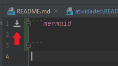

# Exercícios

**Nota:** para cada exercício, existe um script na pasta [atividades](.). Esse script gera o banco de dados 
novamente. Ou seja, cada exercício é independente do outro.

**Nota 2:** o script [main.py](main.py) possui a criação de tabelas e inserção de tuplas. 

1. Selecione todas as disciplinas que o professor Fábio dá aula.
2. Selecione todas as disciplinas que o professor Henry dá aula.
3. Selecione todas as disciplinas que o professor Rafael dá aula.
4. Selecione todas as disciplinas que atualmente não possuem nenhum professor atribuído.
5. Selecione todas as disciplinas que possuem exatamente um professor atribuído.
6. Selecione todas as disciplinas que já tiveram mais que um professor atribuído.
7. Selecione todas as disciplinas que já tiveram mais que um professor atribuído, e **ordene-as em ordem cronológica 
   inversa** (do professor que está dando a disciplina atualmente até o professor que deu a disciplina há mais tempo).
8. Selecione todas as disciplinas em que dois professores estão atribuídos à ela **ao mesmo tempo**.
9. Insira o professor Zolin no banco de dados. Atribua a disciplina de `Sociologia` à ele.
10. Remova todos os professores do banco de dados que não possuem nenhuma disciplina atribuída.
11. Usando os comandos `INNER JOIN` e `UNION`, faça um full outer join entre as tabelas professores e materias.
12. Usando a biblioteca [mermaid](https://mermaid-js.github.io/mermaid/#/), desenhe um diagrama de classes para a 
    estrutura do banco de dados disponibilizado. 
    * **Dica:** você pode usar o [mermaid.live](https://mermaid.live) para desenhar o diagrama. Depois você só
      copia-e-cola o código no arquivo [diagrama.md](diagrama.md). O Pycharm também possui um plugin com suporte ao
      mermaid, mas precisa ser baixado antes (este ícone aparecerá quando você abrir o arquivo [diagrama.md](diagrama.md)):
    
      